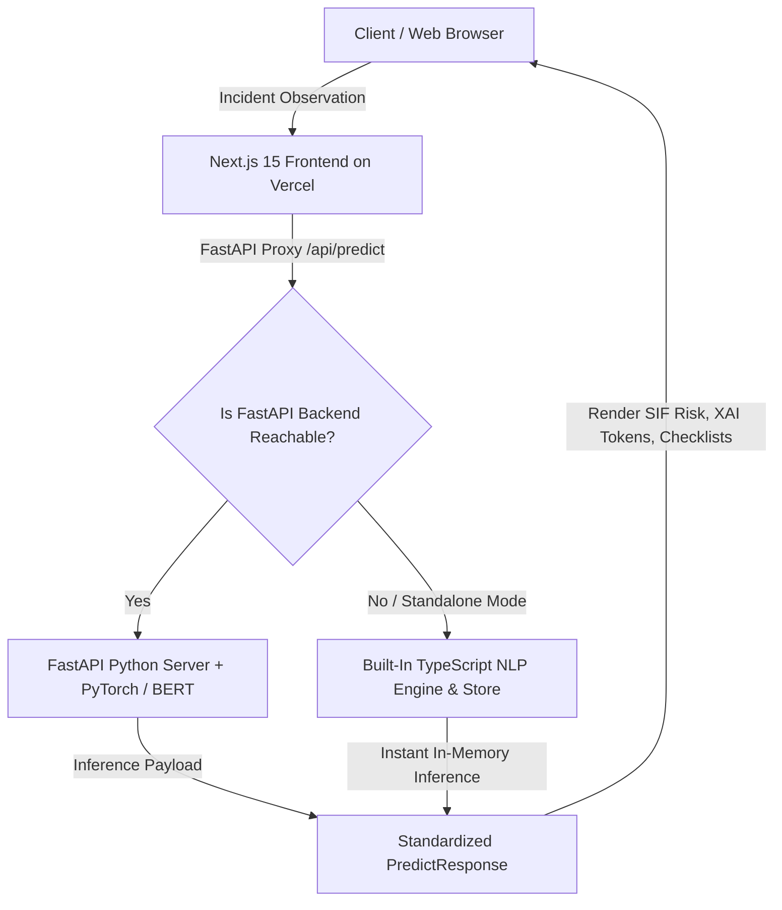

# 🛡️ Apex Safety Intelligence — Industrial SIF Precursor Detection & NLP Platform

[](https://industrial-safety-sif-nlp.vercel.app/)
[](https://nextjs.org/)
[](https://www.typescriptlang.org/)
[](https://fastapi.tiangolo.com/)
[](https://www.python.org/)
[](https://tailwindcss.com/)

> **Enterprise AI/NLP engine for real-time Serious Injury & Fatality (SIF) precursor detection across Oil & Gas field operations, drilling rigs, and industrial processing facilities.**

🔗 **Live Application:** [https://industrial-safety-sif-nlp.vercel.app/](https://industrial-safety-sif-nlp.vercel.app/)

---

## 📌 Overview

In high-risk industrial environments (Oil & Gas, Petrochemical, Heavy Construction), traditional incident reporting often buries high-risk precursors under thousands of routine minor observations.

**Apex Safety Intelligence** solves this by applying state-of-the-art **Natural Language Processing (NLP)** and **Explainable AI (XAI)** to unstructured incident text in real-time, automatically identifying SIF precursors, classifying risk severity, mapping observations to **IOGP Life-Saving Rules**, and generating preventive barrier checklists.

---

## ✨ Key Features

- **⚡ Real-Time SIF Precursor Classification:** Instantly evaluates incident descriptions and determines if an event carries high-potential Serious Injury & Fatality (SIF) risk.
- **🔍 Explainable AI (XAI) Token Tracking:** Highlights high-risk trigger keywords (*e.g., flashover, voltage, bypassed, harness, lockout, H2S*) with localized risk weights.
- **📋 Automated IOGP Life-Saving Rules Mapping:** Automatically assigns incidents to standard global safety rules (*Hot Work, Energy Isolation, Confined Space, Line of Fire, Working at Heights, etc.*).
- **🛡️ Safety Barrier & Preventive Action Engine:** Identifies compromised safety barriers and generates actionable mitigation checklists for field supervisors.
- **📊 Interactive Incident Registry (5,248+ Records):** Searchable, filterable audit registry with pagination, status triage (*Pending, Reviewed, Escalated, Resolved*), and CSV/JSON export.
- **📈 Advanced Analytics & Zone Heatmaps:** 30-day incident velocity trends, precursor keyword frequency clouds, and facility risk scoring (*e.g., CPF, Tank Farms, Rig Floors*).
- **📂 Bulk CSV / Batch Assessment:** Upload raw safety inspection logs to batch-classify thousands of records simultaneously.

---

## 🏗️ System Architecture

The platform uses a resilient **Dual-Engine Architecture**:



---

## 🛠️ Technology Stack

### **Frontend & UI**
- **Framework:** Next.js 15 (App Router, Turbopack)
- **Language:** TypeScript
- **Styling:** Vanilla CSS + Tailwind CSS (Custom Dark Industrial Theme)
- **Icons & Visuals:** Lucide React
- **Hosting:** Vercel Global Edge Network

### **Backend & Machine Learning (Optional Microservice)**
- **API Framework:** FastAPI, Uvicorn
- **Language:** Python 3.10+
- **NLP / ML:** PyTorch, Hugging Face Transformers (BERT / DistilBERT)
- **Data Handling:** Pandas, NumPy, Scikit-learn

---

## 🚀 Getting Started Locally

### **Prerequisites**
- [Node.js](https://nodejs.org/) (v18 or higher)
- [Python](https://www.python.org/) (v3.10+ — optional for backend)
- [Git](https://git-scm.com/)

### **1. Clone the Repository**
```bash
git clone https://github.com/suhanikallapelly/industrial-safety-sif-nlp.git
cd industrial-safety-sif-nlp
```

### **2. Run Frontend (Standalone)**
```bash
cd frontend
npm install
npm run dev
```
Open [http://localhost:3000](http://localhost:3000) in your browser.

---

### **3. (Optional) Run Python FastAPI Backend**
```bash
cd backend
python -m venv venv
# On Windows:
.\venv\Scripts\activate
# On Linux/macOS:
source venv/bin/activate

pip install -r requirements.txt
python -m uvicorn main:app --reload --port 8001
```

---

## 📁 Repository Structure

```text
├── frontend/                 # Next.js 15 Web Application
│   ├── app/                  # Next.js App Router (Pages & API routes)
│   │   ├── api/              # Proxy & local server routes (predict, metrics, incidents)
│   │   ├── predict/          # AI Risk Assessment page
│   │   ├── triage/           # Incident History & Audit Registry
│   │   ├── analytics/        # Risk Analytics & Heatmap Dashboard
│   │   └── upload/           # Bulk CSV Import page
│   ├── components/           # Reusable UI components
│   ├── lib/                  # NLP engines, seed generator & server store
│   └── types/                # TypeScript interfaces
│
├── backend/                  # FastAPI Python Backend
│   ├── main.py               # FastAPI application entrypoint
│   ├── nlp_engine.py         # PyTorch/Transformers BERT inference engine
│   └── run.bat               # Windows quick-launch script
│
├── start_app.bat             # One-click full-stack launcher
└── README.md                 # Project documentation
```

---

## 📜 License

This project is licensed under the **MIT License** — feel free to use and adapt it for educational and industrial research purposes.
